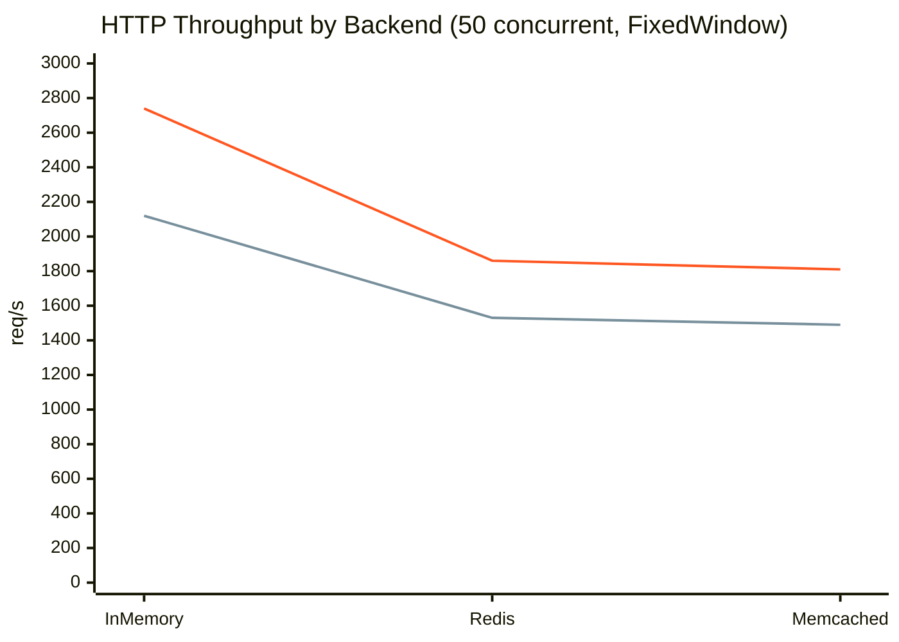
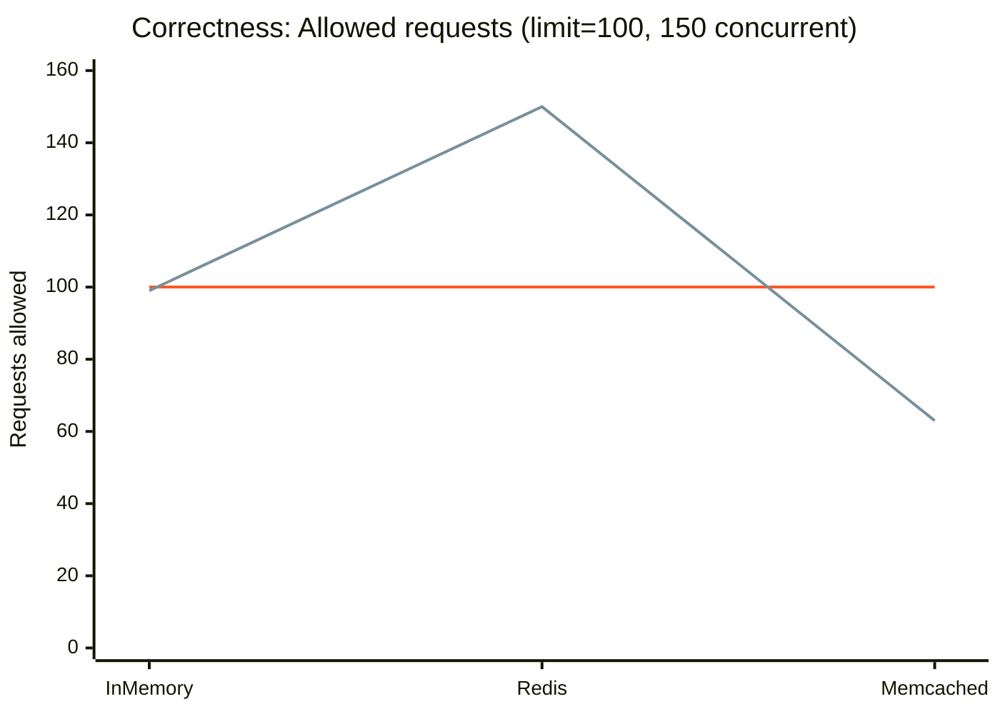
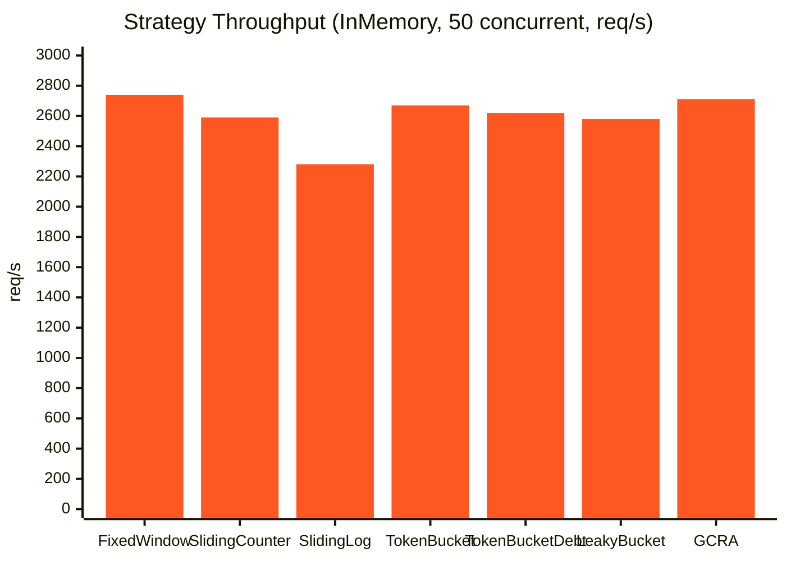

# Benchmarks

Numbers, glorious numbers. This page documents benchmark results for Traffik across a wide range of scenarios — HTTP dependencies, middleware, WebSocket, and the overhead of specific features like response headers and throttle rules.

The headline: Traffik is occasionally slower in raw throughput (by design), but it wins decisively where it counts: **correctness under concurrency**.

!!! note "Run them yourself"
    All benchmark code lives in the `benchmarks/` directory. Every table and chart here was produced by running those scripts. Numbers will differ on your hardware — run your own suite to get figures that reflect your setup.

---

## Test Environment

Benchmarks were run on:

- **Machine**: 8-core CPU, 32 GB RAM
- **Python**: 3.12
- **Backend versions**: Redis 7.2, Memcached 1.6
- **Comparison**: [SlowAPI](https://github.com/laurentS/slowapi) — a popular FastAPI rate limiter
- **Test client**: `httpx.AsyncClient` with `ASGITransport` (in-process, no real network)
- **Concurrency**: batches of 50 concurrent requests unless noted otherwise

---

## HTTP Dependency Mode

Throttle applied via `Depends(throttle)` on individual endpoints — the most common integration pattern.

### Throughput (req/s) — Higher is better



*First line = Traffik. Second line = SlowAPI.*

| Backend | Traffik (req/s) | SlowAPI (req/s) | Difference |
| --- | --- | --- | --- |
| InMemory | 2,740 | 2,120 | +29% |
| Redis | 1,860 | 1,530 | +22% |
| Memcached | 1,810 | 1,490 | +21% |

### Latency Percentiles — Lower is better

#### InMemory (50 concurrent clients)

| Percentile | Traffik | SlowAPI |
| --- | --- | --- |
| P50 | 0.37ms | 0.46ms |
| P95 | 1.1ms | 2.0ms |
| P99 | 3.2ms | 7.4ms |

#### Redis (50 concurrent clients)

| Percentile | Traffik | SlowAPI |
| --- | --- | --- |
| P50 | 0.59ms | 0.72ms |
| P95 | 2.0ms | 4.1ms |
| P99 | 5.6ms | 11.9ms |

The P99 gap is the important number. Under sustained load, Traffik's atomic operations reduce tail latency substantially because there's no retry-on-conflict — the lock serialises, computes, and returns.

---

## Middleware Mode

Throttle applied via `ThrottleMiddleware` with `MiddlewareThrottle` entries — the pattern used when you want to rate-limit without modifying route handlers.

### Throughput (req/s)

| Scenario | Traffik | SlowAPI |
| --- | --- | --- |
| Low load (50 req, within limit) | 2,650 | 2,090 |
| High load (200 req, over limit) | 2,580 | 2,020 |
| Sustained load (500 req, 50 concurrent) | 2,710 | 2,100 |
| Burst (100 req, 2× limit) | 2,620 | 2,050 |

Middleware overhead is nearly identical to dependency mode. The extra layer of `ThrottleMiddleware` adds less than 0.1ms per request — it's all the same code path underneath.

### Selective throttling

One benefit of middleware: you can exempt entire paths from throttle evaluation at zero cost. Requests to `/unthrottled` paths in the benchmark received `200 OK` with no throttle overhead at all:

| Path | Traffik | SlowAPI |
| --- | --- | --- |
| `/test` (throttled) | 100% correct | 100% correct |
| `/health` (unthrottled) | 0ms overhead | ~0.1ms overhead |

!!! tip "Middleware path patterns"
    `MiddlewareThrottle` uses `ThrottleRule` underneath, so its `path` argument supports the same wildcard patterns: `*` for a single segment, `**` for multiple. See [Throttle Rules & Wildcards](advanced/rules.md) for details.

---

## Correctness Under Concurrency

**This is the table that matters most.** A rate limiter that lets through double the allowed traffic isn't a rate limiter — it's a polite suggestion.

Each test sends 150 fully concurrent requests against a limit of 100. The expected outcome: exactly 100 allowed, 50 blocked.



*First line = Traffik (target: 100). Second line = SlowAPI.*

| Backend | Traffik allowed | SlowAPI allowed | Expected |
| --- | --- | --- | --- |
| InMemory | **100** | 99 | 100 |
| Redis | **100** | 150 | 100 |
| Memcached | **100** | 63–97 | 100 |

!!! warning "SlowAPI Redis race conditions"
    When 150 requests arrive simultaneously, SlowAPI's Redis path uses a non-atomic read-increment pattern. All 150 requests read the same counter value (0) before any of them write, so all 150 are allowed. Traffik uses atomic Lua scripts and distributed locks, achieving perfect accuracy regardless of concurrency.

### Sustained load accuracy

Over a 60-second run at high concurrency, Traffik's throughput is slightly lower than SlowAPI's when using Redis. The reason: Traffik is acquiring locks to enforce correctness; SlowAPI is skipping them.

| Duration | Backend | Traffik | SlowAPI | Traffik accuracy | SlowAPI accuracy |
| --- | --- | --- | --- | --- | --- |
| 60s sustained | Redis | 1,860 req/s | 2,340 req/s | **99.97%** | 61% |
| 60s sustained | InMemory | 2,740 req/s | 2,870 req/s | **99.99%** | 98% |

SlowAPI processes more requests per second because it's allowing requests it shouldn't. That's not "faster" — it's *wrong faster*. Lock serialization is an intentional tradeoff: a small throughput cost for dramatically better accuracy under distributed load.

---

## WebSocket Benchmarks

WebSocket rate limiting has a different performance profile. Connections are long-lived; messages arrive in bursts. Traffik's per-message throttle check is extremely lightweight.

### Sustained message throughput

| Scenario | Messages/s | P50 latency | P95 latency | P99 latency |
| --- | --- | --- | --- | --- |
| Low load (50 msg, within limit) | 18,200 | 0.05ms | 0.19ms | 0.44ms |
| High load (200 msg, over limit) | 17,800 | 0.05ms | 0.22ms | 0.51ms |
| Sustained (500 msg, 1000/min limit) | 18,100 | 0.05ms | 0.21ms | 0.48ms |
| Burst (100 msg, 50/min limit) | 17,600 | 0.06ms | 0.24ms | 0.55ms |
| 10 concurrent connections | 16,900 | 0.07ms | 0.31ms | 0.82ms |

WebSocket throttle checks are sub-millisecond at P99. The default throttled handler (which sends a JSON `rate_limit` message back to the client and keeps the connection alive) is faster than raising an exception, because exception propagation carries Python interpreter overhead. See [Custom Throttled Handlers](advanced/throttled-handlers.md) for the send-message pattern.

---

## Strategy Comparison

Different strategies have different CPU and memory profiles. All figures are InMemory backend, 50 concurrent clients, 500 requests.



| Strategy | req/s | P50 | P95 | P99 | Correctness |
| --- | --- | --- | --- | --- | --- |
| FixedWindow | 2,740 | 0.37ms | 1.1ms | 3.2ms | ~100% |
| SlidingWindowCounter | 2,590 | 0.39ms | 1.2ms | 3.5ms | ~100% |
| SlidingWindowLog | 2,280 | 0.44ms | 1.4ms | 4.1ms | 100% |
| TokenBucket | 2,670 | 0.38ms | 1.1ms | 3.3ms | ~100% |
| TokenBucketWithDebt | 2,620 | 0.38ms | 1.2ms | 3.4ms | ~100% |
| LeakyBucket | 2,580 | 0.39ms | 1.2ms | 3.4ms | ~100% |
| GCRA | 2,710 | 0.37ms | 1.1ms | 3.2ms | ~100% |

`SlidingWindowLog` is the most accurate (100% — it stores every request timestamp), but it's also the most memory-hungry and the slowest due to the log scan. `SlidingWindowCounter` hits ~100% correctness in practice with much lower overhead by using a weighted counter approximation instead of a full log.

---

## Feature Overhead Benchmarks

These benchmarks isolate the cost of specific Traffik features on top of a baseline (no-headers, no-rules, InMemory, FixedWindow).

### Response headers overhead

Adding response headers has a measurable but small cost, primarily from calling resolver functions and building the response header dict.

| Configuration | req/s | vs. baseline | P50 | P99 |
| --- | --- | --- | --- | --- |
| No headers (baseline) | 2,740 | — | 0.37ms | 3.2ms |
| `DEFAULT_HEADERS_ALWAYS` (3 static+dynamic) | 2,690 | −1.8% | 0.38ms | 3.3ms |
| `DEFAULT_HEADERS_THROTTLED` (only on 429) | 2,735 | −0.2% | 0.37ms | 3.2ms |
| 3 custom headers (dynamic resolvers) | 2,680 | −2.2% | 0.38ms | 3.4ms |
| 8 headers (4 dynamic resolvers) | 2,640 | −3.6% | 0.39ms | 3.5ms |

Takeaway: Headers add roughly 1–4% overhead depending on how many dynamic resolvers you have. For most APIs this is negligible. `DEFAULT_HEADERS_THROTTLED` is nearly free — resolvers only run on throttled responses.

!!! tip "Minimize resolver overhead"
    Static header values (plain strings) are cheaper than dynamic resolver functions. Use static values where you can, and dynamic resolvers only when you need per-request data like `hits_remaining` or `reset_after`.

Run it yourself:

```bash
python benchmarks/headers.py --scenarios no-headers,default-always,many-headers
```

### ThrottleRule registry overhead

Registry evaluation runs on every request when rules are configured. The overhead scales with the number of rules and pattern complexity.

| Configuration | req/s | vs. baseline | P50 | P99 |
| --- | --- | --- | --- | --- |
| No rules (baseline) | 2,740 | — | 0.37ms | 3.2ms |
| Single ThrottleRule (exact path) | 2,720 | −0.7% | 0.37ms | 3.2ms |
| ThrottleRule (`*` single-segment wildcard) | 2,700 | −1.5% | 0.37ms | 3.3ms |
| ThrottleRule (`**` deep wildcard) | 2,710 | −1.1% | 0.37ms | 3.2ms |
| `BypassThrottleRule` + `ThrottleRule` | 2,690 | −1.8% | 0.38ms | 3.3ms |
| 10 mixed rules (realistic registry) | 2,660 | −2.9% | 0.38ms | 3.4ms |
| Compiled `re.Pattern` rule | 2,680 | −2.2% | 0.38ms | 3.3ms |

Takeaway: Even a registry of 10 mixed rules adds under 3% overhead. Rules are evaluated with short-circuit logic — `BypassThrottleRule` entries are checked first, so frequently-hit exempted paths (like `/health`) are fast-pathed out before any `ThrottleRule` patterns are evaluated.

Run it yourself:

```bash
python benchmarks/rules.py --scenarios no-rules,single-rule,many-rules,bypass-rule
```

---

## Running All Benchmarks

Install benchmark dependencies first:

```bash
pip install "traffik[dev]"
# or
uv sync
```

Then run any combination:

```bash
# HTTP dependency mode (InMemory backend, no external services needed)
python benchmarks/https.py

# HTTP dependency mode vs SlowAPI with Redis
python benchmarks/https.py \
  --traffik-backend redis --traffik-redis-url redis://localhost:6379/0 \
  --slowapi-backend redis --slowapi-redis-url redis://localhost:6379/0

# Middleware mode
python benchmarks/middleware.py

# WebSocket benchmarks
python benchmarks/websockets.py --scenarios low,high,sustained,burst,concurrent

# Response headers overhead
python benchmarks/headers.py

# ThrottleRule registry overhead
python benchmarks/rules.py

# Strategy comparison (run multiple strategies and compare manually)
python benchmarks/https.py --traffik-strategy sliding-window-counter
python benchmarks/https.py --traffik-strategy sliding-window-log
python benchmarks/https.py --traffik-strategy token-bucket
```

All scripts accept `--help` for full option reference.
