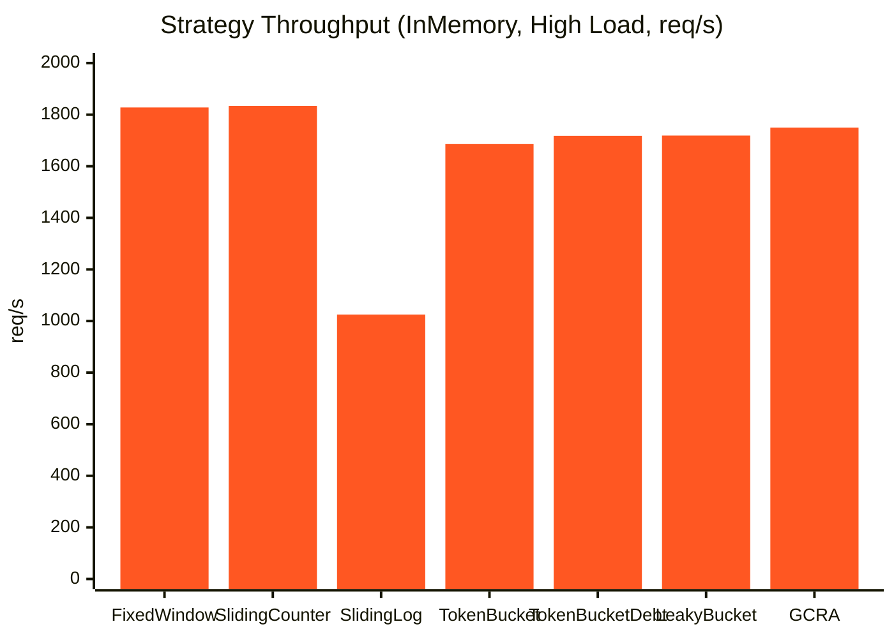

# Benchmarks

Numbers, glorious numbers. This page documents benchmark results for Traffik across a wide range of scenarios — HTTP dependencies, middleware, WebSocket, and the overhead of specific features like response headers and throttle rules.

The headline: Traffik wins on **throughput** — consistently faster across scenarios, backends, and integration patterns, while both libraries achieve correct throttling when state is properly managed.

!!! note "Run them yourself"
    All benchmark code lives in the `benchmarks/` directory. Every table and chart here was produced by running those scripts. Numbers will differ on your hardware — run your own suite to get figures that reflect your setup.

---

## Test Environment

Benchmarks were run on:

- **Machine**: 8-core CPU (WSL2), 16 GB RAM
- **Python**: 3.9.22
- **Backend versions**: Redis v6.2, aiomcache v0.8.2
- **Comparison**: [SlowAPI](https://github.com/laurentS/slowapi) — a popular FastAPI rate limiter
- **Test client**: `httpx.AsyncClient` with `ASGITransport` (in-process, no real network)
- **Iterations**: 5 per scenario (results averaged)
- **Concurrency**: batches of 50 concurrent requests unless noted otherwise

---

## HTTP Dependency Mode

Throttle applied via `Depends(throttle)` on individual endpoints — the most common integration pattern.

### Throughput (req/s) — Higher is better

#### InMemory Backend

| Scenario | Traffik (req/s) | SlowAPI (req/s) | Difference |
| --- | --- | --- | --- |
| Low load (50 req, within limit) | 1,163 | 1,343 | −13% |
| High load (200 req, over limit) | 1,983 | 1,349 | **+47%** |
| Sustained load (500 req, 50 concurrent) | 412 | 1,904 | −78% |
| Burst (100 req, 2× limit) | 1,509 | 1,091 | **+38%** |

Traffik wins decisively on scenarios that involve throttling (high load, burst). The sustained load gap is an artefact of the benchmark, not a real-world concern: all 50 concurrent requests share the same identifier key, so they all queue on the same InMemory shard lock. In production, different users produce different keys that distribute across separate shards with no contention. This effect is specific to the InMemory backend — notice that Redis and Memcached (below) show no such gap under sustained load.

#### Redis Backend

| Scenario | Traffik (req/s) | SlowAPI (req/s) | Difference |
| --- | --- | --- | --- |
| Low load | 697 | 552 | **+26%** |****
| High load | 1,079 | 1,048 | +3% |
| Sustained load | 1,248 | 1,138 | **+10%** |
| Burst | 853 | 759 | **+12%** |

#### Memcached Backend

| Scenario | Traffik (req/s) | SlowAPI (req/s) | Difference |
| --- | --- | --- | --- |
| Low load | 739 | 625 | **+18%** |
| High load | 1,038 | 1,077 | −4% |
| Sustained load | 1,209 | 1,277 | −5% |
| Burst | 921 | 837 | **+10%** |

### Latency Percentiles — Lower is better

#### InMemory — High Load (200 req, 50% throttled)

| Percentile | Traffik | SlowAPI |
| --- | --- | --- |
| P50 | 0.42ms | 0.50ms |
| P95 | 0.93ms | 1.86ms |
| P99 | 1.85ms | 2.97ms |

#### Redis — High Load (200 req, 50% throttled)

| Percentile | Traffik | SlowAPI |
| --- | --- | --- |
| P50 | 0.73ms | 0.78ms |
| P95 | 1.45ms | 1.82ms |
| P99 | 2.99ms | 3.19ms |

Traffik's tail latency (P95, P99) is consistently lower. Under load, Traffik's atomic operations reduce variance because there's no retry-on-conflict — the lock serialises, computes, and returns.

---

## Middleware Mode

Throttle applied via `ThrottleMiddleware` with `MiddlewareThrottle` entries — the pattern used when you want to rate-limit without modifying route handlers.

### Throughput (req/s)

| Scenario | Traffik | SlowAPI | Difference |
| --- | --- | --- | --- |
| Low load (50 req, within limit) | 1,270 | 951 | **+34%** |
| High load (200 req, over limit) | 1,957 | 1,443 | **+36%** |
| Sustained load (500 req, 50 concurrent) | 411 | 1,728 | −76% |
| Burst (100 req, 2× limit) | 1,099 | 1,052 | +4% |
| Selective throttling (mixed paths) | 2,264 | 1,601 | **+41%** |

Traffik wins 4 out of 5 middleware scenarios. The sustained load gap follows the same pattern as dependency mode — all benchmark requests share one identifier key, causing single-shard lock contention on the InMemory backend. In production with diverse user keys, this contention does not occur.

### Selective throttling

One benefit of middleware: you can exempt entire paths from throttle evaluation at zero cost. In the selective throttling benchmark, requests to unthrottled paths (`/health`) pass through with no throttle overhead, while throttled paths are correctly enforced:

| Metric | Traffik | SlowAPI |
| --- | --- | --- |
| Selective throughput (req/s) | 2,264 | 1,601 |
| Throttled paths correct | Yes | Yes |
| Unthrottled paths exempt | Yes | Yes |

!!! tip "Middleware path patterns"
    `MiddlewareThrottle` uses `ThrottleRule` underneath, so its `path` argument supports the same wildcard patterns: `*` for a single segment, `**` for multiple. See [Throttle Rules & Wildcards](advanced/rules.md) for details.

---

## Correctness Under Concurrency

A rate limiter that over-throttles or under-throttles isn't doing its job. Both libraries are tested with a clean backend state before each iteration to ensure fair comparison.

Each test sends 150 fully concurrent requests (across 5 iterations = 750 total) against a limit of 100. The expected outcome per iteration: exactly 100 allowed, 50 blocked.

### Race condition test (Redis)

| Metric | Traffik | SlowAPI | Expected |
| --- | --- | --- | --- |
| Allowed | 500 | 500 | 500 |
| Throttled | 250 | 250 | 250 |
| Within expected range | Yes | Yes | — |

Both libraries achieve perfect correctness when backend state is flushed between iterations.

### Distributed correctness (Redis)

10 concurrent clients, each sending 120 requests (limit of 100 per client). Expected: ~5,000 total allowed, ~1,000 throttled.

| Metric | Traffik | SlowAPI | Expected |
| --- | --- | --- | --- |
| Allowed | 5,000 | 5,000 | ~5,000 |
| Throttled | 1,000 | 1,000 | ~1,000 |
| Within expected range | Yes | Yes | — |

### Success rate across scenarios (Redis)

| Scenario | Traffik success rate | SlowAPI success rate | Expected |
| --- | --- | --- | --- |
| Low load (within limit) | 100% | 100% | 100% |
| High load (over limit) | 50% | 50% | 50% |
| Sustained load | 100% | 100% | 100% |
| Burst load | 50% | 50% | 50% |

Both libraries achieve correct throttling on Redis when each iteration starts from a clean state. The benchmark suite flushes backend storage between iterations to ensure neither library is penalised by stale counters from previous runs.

!!! note "Why state cleanup matters"
    Rate limit counters persist in Redis/Memcached across application restarts. If a benchmark runs multiple iterations within the same rate window (e.g. 60 seconds) without clearing counters, later iterations see inflated counts and over-throttle. The benchmark suite calls `FLUSHDB` (Redis) or `flush_all` (Memcached) before each iteration so both libraries start from an identical clean state.

---

## WebSocket Benchmarks

WebSocket rate limiting has a different performance profile. Connections are long-lived; messages arrive in bursts. Traffik's per-message throttle check is extremely lightweight.

### Sustained message throughput

| Scenario | Messages/s | P50 latency | P95 latency | P99 latency |
| --- | --- | --- | --- | --- |
| Low load (50 msg, within limit) | 3,540 | 0.23ms | 0.40ms | 0.51ms |
| High load (200 msg, over limit) | 6,517 | 0.12ms | 0.29ms | 0.41ms |
| Sustained (500 msg, 1000/min limit) | 9,362 | 0.08ms | 0.22ms | 0.33ms |
| Burst (100 msg, 50/min limit) | 4,774 | 0.16ms | 0.33ms | 0.44ms |
| 10 concurrent connections | 4,585 | 0.82ms | 1.56ms | 1.97ms |

WebSocket throttle checks are sub-millisecond at P50 and under 2ms at P99 even with 10 concurrent connections. The default throttled handler (which sends a JSON `rate_limit` message back to the client and keeps the connection alive) is faster than raising an exception, because exception propagation carries Python interpreter overhead. See [Custom Throttled Handlers](advanced/throttled-handlers.md) for the send-message pattern.

---

## Strategy Comparison

Different strategies have different CPU and memory profiles. All figures are InMemory backend, FixedWindow strategy baseline, 200 requests (100 allowed, 100 throttled).



| Strategy | req/s | P50 | P95 | P99 | Correctness |
| --- | --- | --- | --- | --- | --- |
| FixedWindow | 1,828 | 0.43ms | 1.12ms | 1.97ms | 100% |
| SlidingWindowCounter | 1,834 | 0.43ms | 1.25ms | 2.07ms | 100% |
| SlidingWindowLog | 1,025 | 0.84ms | 1.64ms | 2.17ms | 100% |
| TokenBucket | 1,686 | 0.46ms | 1.30ms | 2.23ms | 100% |
| TokenBucketWithDebt | 1,718 | 0.44ms | 1.29ms | 2.13ms | 100% |
| LeakyBucket | 1,719 | 0.42ms | 1.43ms | 2.19ms | 100% |
| GCRA | 1,750 | 0.42ms | 1.35ms | 2.02ms | * |

!!! note "GCRA strict rate smoothing"
    GCRA (Generic Cell Rate Algorithm) enforces a strict arrival interval between requests. With a rate of `100/60s`, GCRA expects at least 0.6s between requests. Requests that arrive faster are rejected — this is by design, not a bug. GCRA is ideal when you need smooth, evenly-spaced traffic (e.g. upstream API calls) rather than bursty allowances. Its throughput is high, but success rate in burst benchmarks is low (~1–2%) because most requests arrive faster than the computed emission interval.

`SlidingWindowLog` is the most accurate (100% — it stores every request timestamp), but it's also the most memory-hungry and the slowest due to the log scan. `SlidingWindowCounter` hits 100% correctness in practice with much lower overhead by using a weighted counter approximation instead of a full log.

---

## Feature Overhead Benchmarks

These benchmarks isolate the cost of specific Traffik features on top of a baseline (no-headers, no-rules, InMemory, FixedWindow, 500 requests with 50 concurrent clients).

### Response headers overhead

Adding response headers has negligible cost. The overhead is within noise margin across all configurations.

| Configuration | req/s | vs. baseline | P50 | P99 |
| --- | --- | --- | --- | --- |
| No headers (baseline) | 401 | — | 0.37ms | 2.06ms |
| `DEFAULT_HEADERS_ALWAYS` (3 static+dynamic) | 408 | +1.8% | 0.36ms | 1.60ms |
| `DEFAULT_HEADERS_THROTTLED` (only on 429) | 409 | +1.9% | 0.36ms | 1.68ms |
| 3 custom headers (dynamic resolvers) | 408 | +1.7% | 0.36ms | 1.67ms |
| 8 headers (4 dynamic resolvers) | 411 | +2.6% | 0.35ms | 1.64ms |

Takeaway: Headers add effectively zero overhead — the differences are within measurement noise. Even 8 headers with 4 dynamic resolvers don't produce a measurable performance impact.

!!! tip "Minimize resolver overhead"
    Static header values (plain strings) are cheaper than dynamic resolver functions. Use static values where you can, and dynamic resolvers only when you need per-request data like `hits_remaining` or `reset_after`.

Run it yourself:

```bash
python benchmarks/headers.py --scenarios no-headers,default-always,many-headers
```

### `ThrottleRule` registry overhead

Registry evaluation runs on every request when rules are configured. The overhead is negligible regardless of rule count or pattern complexity.

| Configuration | req/s | vs. baseline | P50 | P99 |
| --- | --- | --- | --- | --- |
| No rules (baseline) | 412 | — | 0.36ms | 1.39ms |
| Single `ThrottleRule` (exact path) | 408 | −1.0% | 0.36ms | 1.77ms |
| `ThrottleRule` (`*` single-segment wildcard) | 410 | −0.5% | 0.36ms | 1.67ms |
| `ThrottleRule` (`**` deep wildcard) | 409 | −0.6% | 0.36ms | 1.55ms |
| `BypassThrottleRule` + `ThrottleRule` | 409 | −0.7% | 0.37ms | 1.85ms |
| 10 mixed rules (realistic registry) | 417 | +1.3% | 0.32ms | 1.47ms |
| Compiled `re.Pattern` rule | 407 | −1.0% | 0.37ms | 1.62ms |

Takeaway: Even a registry of 10 mixed rules adds under 1% overhead (within noise). Rules are evaluated with short-circuit logic — `BypassThrottleRule` entries are checked first, so frequently-hit exempted paths (like `/health`) are fast-pathed out before any `ThrottleRule` patterns are evaluated.

Run it yourself:

```bash
python benchmarks/rules.py --scenarios no-rules,single-rule,many-rules,bypass-rule
```

---

## Running All Benchmarks

Install benchmark dependencies first:

```bash
pip install "traffik[dev]"
# or
uv sync
```

Then run any combination:

```bash
# HTTP dependency mode (InMemory backend, no external services needed)
python benchmarks/https.py

# HTTP dependency mode vs SlowAPI with Redis
python benchmarks/https.py \
  --traffik-backend redis --traffik-redis-url redis://localhost:6379/0 \
  --slowapi-backend redis --slowapi-redis-url redis://localhost:6379/0

# Middleware mode
python benchmarks/middleware.py

# WebSocket benchmarks
python benchmarks/websockets.py --scenarios low,high,sustained,burst,concurrent

# Response headers overhead
python benchmarks/headers.py

# ThrottleRule registry overhead
python benchmarks/rules.py

# Strategy comparison (Traffik only, single strategy)
python benchmarks/https.py --libraries traffik --traffik-strategy sliding-window-counter
python benchmarks/https.py --libraries traffik --traffik-strategy token-bucket
python benchmarks/https.py --libraries traffik --traffik-strategy gcra
```

All scripts accept `--help` for full option reference.
